# Pulsar's High Level Startup Overview

It's no secret that Pulsar since inherited from Atom, is a big and complex application.

With many discrete, moving aspects, that not all developers have a concrete grasp on.
The goal of this document is to make the architecture of Pulsar, as well as the logical flow
more understandable and approachable.

This will be accomplished through a series of illustrations detailing the functional decomposition and detailed logical flow of Pulsar and it's parts, as well as lists of what's accomplished in each part.

This document is aimed at those roughly familiar with the large scale goals and features of Pulsar, as well as those with a basic understanding of the package model used to power much of Pulsar's functionality.



<details>
<summary>
MermaidJS to create image above
</summary>

```
flowchart TD
    id1("`Initialization
        *./src/main-process/main.js*`") --> id2("`Startup
                                            *./src/main-process/start.js*`")
    id2 --> id3("`Main Process Tests`")
    id2 --> id4("`Application Startup
                 *./src/main-process/atom-application.js*`")
    id2 --> id5("`Startup w/ Squirrel
                *./src/main-process/squirrel-update.js*`")
    id4 --> id6("`Test Runner
                *./src/initialize-test-window.js*`")
    id4 --> id7("`Initialize Application Window
                *./src/initialize-application-window.js*`")
    id7 --> id9("`'The World'
                *./src/atom-environment.js*`")
    id7 --> id10("`ApplicationDelegate
                *./src/application-delegate.js*`")
    id7 --> id8("`Clipboard
                *./src/clipboard.js*`")
    id8 --> id9
    id10 --> id9
```

</details>

---

To further outline what occurs in the steps above:

## Initialization

Startup of Pulsar occurs within `./src/main-process/main.js`.

Which Determines:
  - `resourcePath`
  - `devResourcePath`
  - `stableResourcePath`
  - `defaultRepositoryPath`

Which Sets:
  - Application Start Time

Which Does:
  - Initializes Startup of `./src/main-process/start.js`

## Startup

The more general startup handling of Pulsar occurs within `./src/main-process/start.js`.

Which Sets:
  - Shell Start Time
  - `app.allowRendererProcessReuse`: `false`
  - `app.commandLine.appendSwitch('enable-experimental-web-platform-features')`
  - `app.commandLine.appendSwitch('force-color-profile', config.get('core.colorProfile'))`
  - `app.setAppUserModelId()`
  - `app.on('open-file', $)`
  - `app.on('open-url', $)`

Which Does:
  - Normalizes the `resourcePath` and `devResourcePath`
  - Uses `Config` to locate and read the config file
  - `atomPaths.setAtomHome()`
  - `atomPaths.setUserData()`
  - May defer to `./src/main-process/squirrel-update.js` to startup if on Windows
  - May defer to `./spec/main-process/mocha-test-runner.js` to startup main process tests
  - May call `.open()` on `./src/main-process/atom-application.js`

## Application Startup

The proper startup of the Pulsar Application occurs within `./src/main-process/atom-application.js`.

Which Sets:
  - `APPLICATION_STATE_VERSION`
  - Global `atomApplication`

Which Does:
  - Does setup of the application socket
  - Handles deprecated benchmark startup
  - Ensures to return a new instance of `AtomApplication`
  - Registers basic application commands
  - Initializes:
    * `ApplicationMenu`
    * `AtomProtocolHandler`
    * `WindowStack`
    * `FileRecoveryService`
    * `Config`
    * `StorageFolder`
    * `AutoUpdateManager`
  - May startup the package test runner
  - May quit if asked to startup in benchmark mode
  - May open previously opened files/folders
  - May open new instance of Pulsar

## Initialize Application Window

Begins initialization of an individual Pulsar window, occurs within `./src/initialize-application-window.js`.

Which Determines:

Which Sets:
  - Sets the `global.atom` to a new instance of `AtomEnvironment`

Which Does:
  - triggers `.preloadPackages()`
  - Initializes:
    * Clipboard
    * AtomEnvironment
    * ApplicationDelegate

## 'The World'

'The World' refers to being within the Pulsar application, most of the application occurs within here.
This code lives within `./src/atom-environment.js`.

An important note about being initialized within the world, there is no access to the `atom`
global, until the initial constructor completes processing. Meaning great care must be taken
to ensure if `atom` is available within the initialized modules.

Which Sets:
  - `AtomEnvironment.version`: `1` | Possibly a reference to `APPLICATION_STATE_VERSION`?
  - `AtomEnvironment.saveStateDebounceInterval`: `1000`

Which Does:
  - Initializes:
    * Clipboard | Inherited from 'Initialize Application Window'
    * ApplicationDelegate | Inherited from 'Initialize Application Window'
    * DeserializerManager
    * ViewRegistry
    * NotificationManager
    * StateStore
    * Config
    * KeymapManager
    * TooltipManager
    * CommandRegistry
    * URIHandlerRegistry
    * GrammarRegistry
    * StyleManager
    * PackageManager
    * ThemeManager
    * MenuManager
    * ContextMenuManager
    * Project
    * CommandInstaller
    * ProtocolHandlerInstaller
    * TextEditorRegistry
    * Workspace
    * AutoUpdateManager
    * WindowEventHandler
    * HistoryManager
