# Package Preload

Pulsar's packages are preloaded, very early on within the startup cycle of Pulsar.

As it's called immediatly after the `atom` global is initialized, it's important to understand what steps occur during preloading, and what package's are affected.



---

<details>
<summary>
MermaidJS to create image above
</summary>

```
flowchart TD
    iaw["`
        initialize-application-window.js
        Called right after global 'atom' is set
    `"] -->
    ae["`
        AtomEnvironment
        .preloadPackages()
    `"] -->
    pl1["preloadPackages()"] -->|if in packageCache| sg1

    subgraph sg1
    direction LR
    pl2["preloadPackage()"]
    pl2 -->|"call .preload()"| tp1["new ThemePackage"]
    pl2 -->|"call .preload()"| p1["new Package"]

    p1 --> p1Pre["`
        this.preload() call:
        Does more than advertised here
    `"]

    p1Pre --> lk1[".loadKeymaps()"]
    lk1 --> pcRead1["`Read from packagesCache:
        If bundled package && in packagesCache`"]
    lk1 --> fileRead1["`Read from file:
        If !bundled || !in packagesCache`"]

    p1Pre --> lm1[".loadMenus()"]
    lm1 --> pcRead1
    lm1 --> fileRead1

    p1Pre --> acss[".activateCoreStartupServices()"]
    p1Pre --> rmm[".requireMainModule()"]

    acss --> rmm

    p1Pre --> ls1[".loadSettings()"]
    ls1 --> pcRead1
    ls1 --> fileRead1

    p1Pre --> ak1[".activateKeymaps()"]
    p1Pre --> am1[".activateMenus()"]

    tp1 --> tp1Pre[".preload()"]
    tp1Pre --> csrol1[".reigsterConfigSchemaFromMetadata()"]
    end
```

</details>
