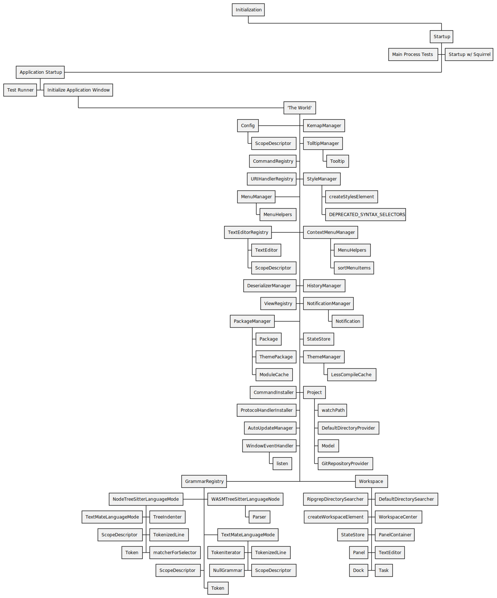

# 'The World'

While it's difficult to convey the full scope of how Pulsar works internally, just like the previous page [`overview.md`](./overview.md) detailed the general gist of how Pulsar starts up, this document provides a quick reference to how all the interal parts of Pulsar are connected.

This document is not at all comprehensive, and must ensure to be continually updated. Additionally, this image does not track outside dependency usage, nor dependence on every single internal module. Focusing mostly on modules that are either required during initialization, or are referenced during the constructor of their respective class.

<details>
<summary>
Details on the creation of this image
</summary>

This image has been created with Plant UML. A Live editor is available [here](https://www.plantuml.com/plantuml/uml).

The code used to create this image:

```uml
@startwbs
* Initialization
** Startup
***< Main Process Tests
*** Startup w/ Squirrel
***< Application Startup
****< Test Runner
**** Initialize Application Window
***** 'The World'
******< Config
******* ScopeDescriptor
****** KemapManager
****** TolltipManager
******* Tooltip
******< CommandRegistry
******< URIHandlerRegistry
****** StyleManager
******* createStylesElement
******* DEPRECATED_SYNTAX_SELECTORS
******< MenuManager
******* MenuHelpers
****** ContextMenuManager
******* MenuHelpers
******* sortMenuItems
******< TextEditorRegistry
******* TextEditor
******* ScopeDescriptor
****** HistoryManager
******< DeserializerManager
******< ViewRegistry
****** NotificationManager
******* Notification
****** StateStore
******< PackageManager
******* Package
******* ThemePackage
******* ModuleCache
****** ThemeManager
******* LessCompileCache
****** Project
******* watchPath
******* DefaultDirectoryProvider
******* Model
******* GitRepositoryProvider
******< CommandInstaller
******< ProtocolHandlerInstaller
******< AutoUpdateManager
******< WindowEventHandler
******* listen
******< GrammarRegistry
*******< NodeTreeSitterLanguageMode
******** TreeIndenter
********< TextMateLanguageMode
******** TokenizedLine
********< ScopeDescriptor
******** matcherForSelector
********< Token
******* WASMTreeSitterLanguageNode
******** Parser
******* TextMateLanguageMode
******** TokenizedLine
********< TokenIterator
******** ScopeDescriptor
********< NullGrammar
*******< ScopeDescriptor
******* Token
****** Workspace
******* DefaultDirectorySearcher
*******< RipgrepDirectorySearcher
******* WorkspaceCenter
*******< createWorkspaceElement
******* PanelContainer
*******< StateStore
******* TextEditor
*******< Panel
******* Task
*******< Dock
@endwbs
```

</details>

---


