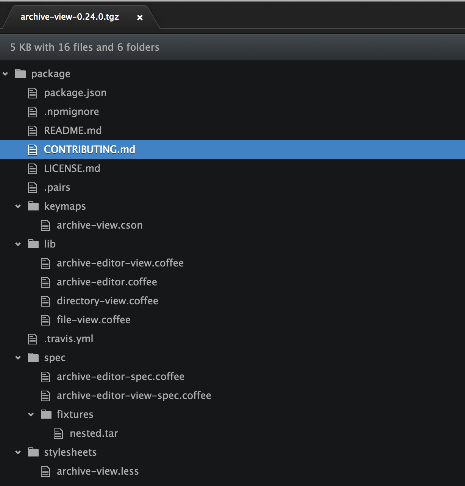

# Archive view package

Adds support for browsing archive files in Pulsar with the following extensions:

* `.egg`
* `.epub`
* `.jar`
* `.love`
* `.nupkg`
* `.tar`
* `.tar.gz`
* `.tgz`
* `.war`
* `.whl`
* `.xpi`
* `.zip`

Select a file to extract it to a temp file and open it in a new editor.

