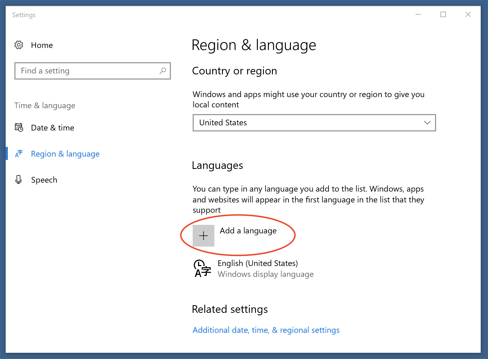
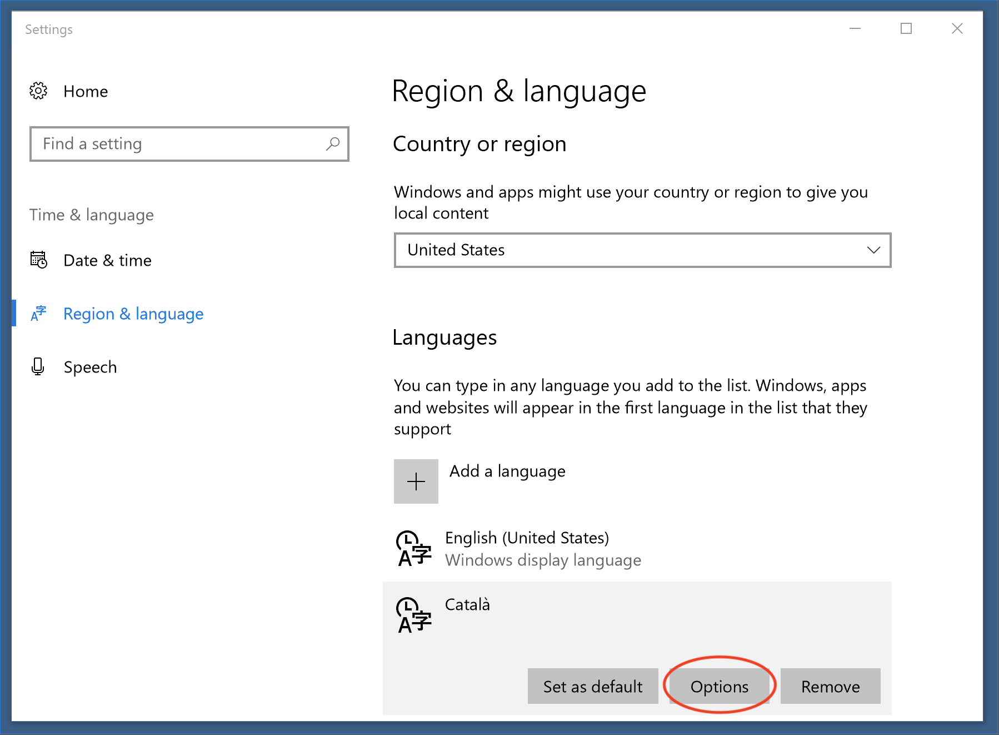
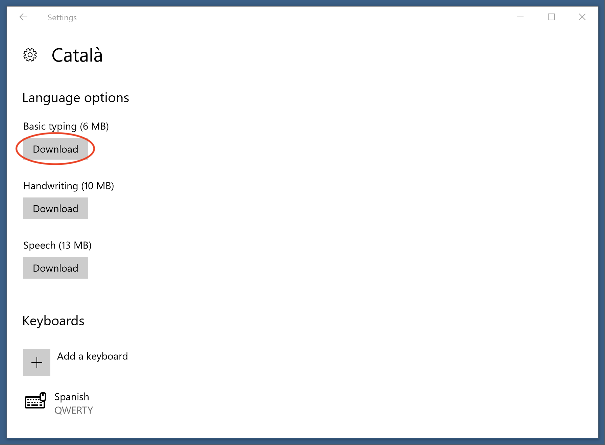

# Spell Check package

Highlights misspelling in Pulsar and shows possible corrections.

Use <kbd>cmd-shift-:</kbd> for Mac or <kbd>ctrl-shift-:</kbd> for Windows or Linux to bring up the list of corrections when your cursor is on a misspelled word.

By default spell check is enabled for the following files:

* Plain Text
* GitHub Markdown
* Git Commit Message
* AsciiDoc
* reStructuredText

You can override this from the _Spell Check_ settings in the Settings View (<kbd>cmd-,</kbd>). The Grammars config option is a list of scopes for which the package will check for spelling errors.

To enable _Spell Check_ for your current file type: put your cursor in the file, open the [Command Palette](https://github.com/pulsar-edit/command-palette)
(<kbd>cmd-shift-p</kbd> for Mac or <kbd>ctrl-shift-p</kbd> for Windows or Linux), and run the `Editor: Log Cursor Scope` command. This will trigger a notification which will contain a list of scopes. The first scope that's listed is the one you should add to the list of scopes in the settings for the _Spell Check_ package. Here are some examples: `source.coffee`, `text.plain`, `text.html.basic`.

## Changing the dictionary

Except for Mac, Pulsar needs to know what language to use to perform spell-checking. To list these, set the "Locales" configuration option to the [IETF tag](https://www.iana.org/assignments/language-subtag-registry/language-subtag-registry) (en-US, fr-FR, etc). More than one language can be used, simply separate them by commas.

If no locale is given, then Pulsar will attempt to infer the language based on environment variables and settings.

If any value is given for the "Locales", then Pulsar will not automatically add the browser language. So, if your browser is United States English (`en-US`), leaving this blank will still do US English checking. However, if it the "Locales" is set to French (`fr-FR`), then the checker will only check French. If the "Locales" is set to `en-US, fr-FR`, then both languages will be checked.

### Missing Languages

This plugin uses the existing system dictionaries. If a locale is selected that is not installed, a warning will pop up when a document that would be spell-checked is loaded. To disable this, either remove the incorrect language from the "Locales" configuration or clear the check on "Use Locales" to disable it entirely.

To get the search paths used to look for a dictionary, make sure the "Notices Mode" is set to "console" or "both", then reload Atom. The developer's console will have the directory list.

## Mac

On the Mac, checking "Use System" will use the operating system's spellchecking library. This uses all of the user's loaded dictionaries and doesn't require any customization within Pulsar.

Checking "Use Locales" and providing locales would use Hunspell as additional dictionaries. Having "Use Locales" checked but no locales given will do nothing.

## Windows 8 and Higher

For Windows 8 and 10, this package uses the Windows spell checker, so you must install the language using the regional settings before the language can be chosen inside Pulsar.



If your Windows user does not have Administration privileges, you'll need to do an extra step once the language has been added to enable the spell checker. To do so, you need to install the "Basic typing" language option by following the next steps (you'll be asked for your administrator password):





Once the additional language is added, Pulsar will need to be restarted and configured to use it. Add the IEFT tag into the "Locales" setting for the language to be set.

If a Hunspell dictionary is found on a path (see below), it will be used in favor of the Windows API.

## Linux

For all Linux-based operating systems, "Use System" does nothing. It can remained checked but has no impact. "Use Locales" is required for spell-checking.

### Debian, Ubuntu, and Mint

On Ubuntu, installing "Language Support" may solve problems with the dictionaries. For other distributions (or if Language Support doesn't work), you may use `apt` to install the dictionaries.

```
sudo apt-get install hunspell-en-gb
sudo apt-get install myspell-en-gb
```

On RedHat, the following should work for Italian:

```
sudo dnf install hunspell
sudo dnf install hunspell-it
```

You can get a list of currently installed languages with:

```
/usr/bin/hunspell -D
```

Pulsar may require a restart to pick up newly installed dictionaries.

### Arch Linux

A language may be installed by running:

```
pacman -S hunspell-en_GB
```

For the time being, a soft link may be required if the dictionary provided is "large".

```
cd /usr/share/hunspell
sudo ln -s en_GB-large.dic en_GB.dic
sudo ln -s en_GB-large.aff en_GB.aff
```

## Hunspell Dictionaries

For all platforms, a Hunspell-compatible dictionary is also supported. To use this, a `.dic` and `.aff` need to be located in one of the default search directories or in a directory entered into "Locale paths" (multiples may be entered with commas separating them). If the appropriate files are found for the locale and "Use Locales" is checked, then the dictionary will be used.

For example, if the following is set, then `/usr/share/hunspell/en_US.dic` will be used:

- Use Locales: checked
- Locales: `en-US`
- Locale Paths: `/usr/share/hunspell`

If "Locales" is not provided, then the user's current language will be inferred from environmental settings.

In addition to what is provided, the following paths are checked:

- `/usr/share/hunspell` (Linux only)
- `/usr/share/myspell` (Linux only)
- `/usr/share/myspell/dicts` (Linux only)
- `/` (Mac only)
- `/System/Library/Spelling` (Mac only)
- `C:\` (Windows only)

Dictionaries can be downloaded from various sites (such as [wooorm's repository](https://github.com/wooorm/dictionaries) or [LibreOffice's](https://github.com/LibreOffice/dictionaries)), but the file has to be renamed `locale.dic` and `locale.aff`.

*Example locations to download are not an endorsement.*
